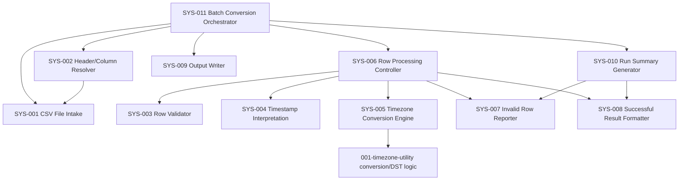

# System Design Description: Batch Timezone Conversion

**Feature Branch**: `003-batch-timezone-conversion`
**Source Document**: `specs/003-batch-timezone-conversion/v-model/requirements.md` (34 requirements: REQ-001–REQ-029 functional, REQ-NF-001–REQ-NF-005 non-functional)
**Supplementary Context**: `specs/003-batch-timezone-conversion/spec.md`
**Generated**: 2026-09-21
**Status**: Draft
**Standard**: IEEE 1016-2009 (Software Design Description)

## Overview

This document decomposes the Batch Timezone Conversion requirements into system components (`SYS-NNN`). The architecture follows a pipeline shape driven directly by the requirement groupings in `requirements.md`: a file-intake stage (REQ-001–REQ-004, REQ-016–REQ-018), a per-row validation stage (REQ-008–REQ-010, REQ-013–REQ-015, REQ-028), a conversion engine that reuses the existing timezone/DST logic from `001-timezone-utility` (REQ-005, REQ-024–REQ-027, REQ-NF-004), an independent per-row processing controller enforcing failure isolation (REQ-006, REQ-011, REQ-NF-001), an output/reporting stage that keeps successful and invalid outputs separate (REQ-007, REQ-019, REQ-020, REQ-029, REQ-NF-002), and a run-summary component (REQ-021–REQ-023, REQ-NF-003). No `v-model-config.yml` was found in the repository, so safety-critical (ISO 26262 / DO-178C / IEC 62304) sections are not applicable and have been omitted.

No existing `system-design.md` was present for this feature, so numbering starts at `SYS-001`.

## ID Schema

- System component IDs use the form `SYS-NNN` (e.g., `SYS-001`), sequential and permanent once assigned.
- Each component's "Parent Requirements" column lists every `REQ-NNN` / `REQ-NF-NNN` it satisfies, in a many-to-many relationship.
- A requirement may be satisfied by more than one component (e.g., REQ-005 is a parent of both `SYS-004` and `SYS-005`); a component may satisfy more than one requirement.
- The Decomposition View table below is the single source of truth for REQ↔SYS traceability, consumed by `validate-system-coverage.sh`-style tooling and by the system-test generation step.

## Decomposition View (IEEE 1016 §5.1)

| SYS ID | Name | Description | Parent Requirements | Type |
|--------|------|--------------|----------------------|------|
| SYS-001 | CSV File Intake | Opens and reads the input CSV file; detects file-level errors (missing/unreadable file) before any row processing begins. | REQ-001, REQ-016, REQ-018 | Module |
| SYS-002 | Header/Column Resolver | Parses the CSV header row to locate the timestamp, source-timezone, and target-timezone columns by name regardless of order; ignores unrecognized extra columns; raises a file-level error when required columns cannot be identified. | REQ-002, REQ-004, REQ-017, REQ-018 | Module |
| SYS-003 | Row Validator | For each row, validates timestamp parseability, source timezone recognizability, and target timezone recognizability; detects and skips entirely blank rows; determines missing-field conditions. | REQ-008, REQ-009, REQ-010, REQ-015, REQ-028 | Module |
| SYS-004 | Timestamp Interpretation Component | Determines how to interpret a row's raw timestamp string, treating the source timezone column as authoritative when no explicit UTC offset is embedded. | REQ-024 | Module |
| SYS-005 | Timezone Conversion Engine | Performs the actual source-to-target timezone conversion for a validated row, applying DST rules in effect for the specific timestamp, including same-timezone (no-op) conversions and date-boundary-crossing results. Reuses conversion/DST logic from the `001-timezone-utility` feature. | REQ-005, REQ-025, REQ-026, REQ-027, REQ-NF-004 | Service |
| SYS-006 | Row Processing Controller | Orchestrates independent, isolated processing of each row: invokes validation, interpretation, and conversion for a row, catches per-row failures, and guarantees that one row's outcome (pass or fail) never affects any other row's processing. | REQ-006, REQ-011, REQ-NF-001 | Module |
| SYS-007 | Invalid Row Reporter | Builds one invalid-row report entry per failed row, capturing the row number and a specific, field-referencing failure reason (unparseable timestamp, unrecognized timezone, missing field). | REQ-012, REQ-013, REQ-014, REQ-015, REQ-NF-002 | Module |
| SYS-008 | Successful Result Formatter | Builds one output record per successfully converted row, containing original input values plus the converted date/time/target-timezone identifier. | REQ-007 | Module |
| SYS-009 | Output Writer | Emits the successful-conversion output and the invalid-row report as two separate, structured (machine-readable) outputs; detects and reports output-destination write failures without discarding already-computed results. | REQ-019, REQ-020, REQ-029 | Module |
| SYS-010 | Run Summary Generator | Computes and presents the total/succeeded/failed row counts for a completed run, explicitly displaying a zero failed-count rather than omitting it, and produces the "no rows processed" message for header-only files. | REQ-021, REQ-022, REQ-023, REQ-NF-003 | Module |
| SYS-011 | Batch Conversion Orchestrator | Top-level subsystem that sequences file intake, column resolution, per-row processing (via SYS-006), output writing, and summary generation for a single batch run; owns the empty-file (header-only, zero data rows) completion path. | REQ-001, REQ-023 | Subsystem |

**Coverage note**: SYS-001 through SYS-011 collectively cover all 34 requirements (REQ-001–REQ-029, REQ-NF-001–REQ-NF-005). REQ-003 (IANA timezone identifier format) is satisfied jointly by SYS-003 (validation of recognizability) and SYS-005 (reuse of existing identifier resolution); see SYS-003/SYS-005 cross-reference below.

*Cross-reference addendum*: REQ-003 is additionally a parent of SYS-003 and SYS-005 (IANA identifier acceptance is exercised both at validation time and at conversion time). REQ-NF-005 (10,000-row batch without splitting) is a parent of SYS-011, reflecting that the orchestrator's row-by-row streaming design is what allows large batches to complete in one run.

| SYS ID | Name | Additional Parent Requirements | Type |
|--------|------|----------------------------------|------|
| SYS-003 | Row Validator | REQ-003 | Module |
| SYS-005 | Timezone Conversion Engine | REQ-003 | Service |
| SYS-011 | Batch Conversion Orchestrator | REQ-NF-005 | Subsystem |

## Dependency View (IEEE 1016 §5.2)

| Source | Target | Relationship | Failure Impact |
|--------|--------|---------------|-----------------|
| SYS-011 Batch Conversion Orchestrator | SYS-001 CSV File Intake | invokes (reads file) | If SYS-001 fails (file missing/unreadable), SYS-011 aborts the run immediately and routes a file-level error to SYS-009 without invoking SYS-002/SYS-006. |
| SYS-011 Batch Conversion Orchestrator | SYS-002 Header/Column Resolver | invokes (parses header) | If SYS-002 cannot identify required columns, SYS-011 aborts the run and routes a file-level error to SYS-009 without processing any row. |
| SYS-011 Batch Conversion Orchestrator | SYS-006 Row Processing Controller | invokes (per row, once per data row) | If SYS-006 raises an unexpected (non-isolated) error for a row, SYS-011 must still continue the run for subsequent rows; a defect here risks violating REQ-011/REQ-NF-001. |
| SYS-011 Batch Conversion Orchestrator | SYS-009 Output Writer | invokes (after batch completes) | If SYS-009 fails to write, SYS-011 must surface the write failure to the user while retaining in-memory results (REQ-029); it must not discard computed conversions. |
| SYS-011 Batch Conversion Orchestrator | SYS-010 Run Summary Generator | invokes (after batch completes) | If SYS-010 fails, the run's per-row outputs are unaffected, but the user loses the total/succeeded/failed summary. |
| SYS-006 Row Processing Controller | SYS-003 Row Validator | invokes (per row) | If SYS-003 fails for a row, SYS-006 routes that row to SYS-007 as invalid and proceeds to the next row; no effect on other rows. |
| SYS-006 Row Processing Controller | SYS-004 Timestamp Interpretation Component | invokes (per row, after validation passes) | If SYS-004 cannot resolve interpretation, SYS-006 treats the row as invalid via SYS-007; other rows unaffected. |
| SYS-006 Row Processing Controller | SYS-005 Timezone Conversion Engine | invokes (per row, after interpretation) | If SYS-005 fails or throws for a row (e.g., unexpected DST edge case), SYS-006 catches it, routes the row to SYS-007, and continues; other rows unaffected. |
| SYS-006 Row Processing Controller | SYS-007 Invalid Row Reporter | invokes (on row failure) | If SYS-007 fails to record an entry, that row risks being silently dropped, violating REQ-NF-002 (zero omitted invalid rows). |
| SYS-006 Row Processing Controller | SYS-008 Successful Result Formatter | invokes (on row success) | If SYS-008 fails to format a result, that row risks being omitted from successful output, violating REQ-NF-001 (100% of valid rows returned). |
| SYS-005 Timezone Conversion Engine | 001-timezone-utility conversion/DST logic (external dependency) | reuses | If the underlying `001-timezone-utility` conversion logic fails or is unavailable, SYS-005 cannot convert any row; SYS-006 must still isolate this as a per-row failure rather than aborting the batch. |
| SYS-002 Header/Column Resolver | SYS-001 CSV File Intake | reads (header row from opened file) | If SYS-001's file handle is invalid, SYS-002 cannot parse a header and reports a file-level error via SYS-011/SYS-009. |
| SYS-010 Run Summary Generator | SYS-007 Invalid Row Reporter | reads (failed-row count) | If SYS-007's entries are incomplete, SYS-010's failed count will be inaccurate. |
| SYS-010 Run Summary Generator | SYS-008 Successful Result Formatter | reads (succeeded-row count) | If SYS-008's records are incomplete, SYS-010's succeeded count will be inaccurate. |

### Dependency Diagram

## Interface View (IEEE 1016 §5.3)

### External Interfaces

| Component | Interface Name | Protocol | Input | Output | Error Handling |
|-----------|------------------|----------|-------|--------|-----------------|
| SYS-001 CSV File Intake | Batch CSV Input Interface | File I/O (local filesystem, CSV) | Path/handle to a CSV file | Raw row stream (header + data rows) | Returns a distinct file-level error (not a row-level error) when the file is missing or unreadable (REQ-016, REQ-018). |
| SYS-009 Output Writer | Successful Output Interface | File/stream I/O (structured, e.g. CSV) | Set of successful conversion records from SYS-008 | Machine-readable output artifact (e.g., CSV) | On write failure, reports the failure to the user and retains already-computed results in memory rather than discarding them (REQ-029). |
| SYS-009 Output Writer | Invalid Row Report Interface | File/stream I/O (structured, e.g. CSV) | Set of invalid-row entries from SYS-007 | Machine-readable invalid-row report, kept separate from successful output (REQ-020) | Same write-failure handling as Successful Output Interface (REQ-029). |
| SYS-010 Run Summary Generator | Run Summary Interface | Console/UI or file text output | Total/succeeded/failed counts | Human-readable summary displaying an explicit zero failed count when applicable (REQ-022) | N/A (presentation only; upstream count errors are attributable to SYS-007/SYS-008). |

### Internal Interfaces

| Source | Target | Interface Name | Protocol | Data Format | Error Handling |
|--------|--------|------------------|----------|--------------|-----------------|
| SYS-011 | SYS-001 | File Open Request | In-process call | File path/handle | Propagates file-level error to SYS-011, which skips row processing entirely (REQ-018). |
| SYS-002 | SYS-001 | Header Row Read | In-process call | Raw header row (list of column names) | Returns a resolver error if required columns are not identifiable (REQ-017). |
| SYS-011 | SYS-002 | Column Resolution Request | In-process call | Header row | Column index/name map for timestamp, source TZ, target TZ; error if unresolved (REQ-017, REQ-018). |
| SYS-006 | SYS-003 | Row Validation Request | In-process call | One raw Conversion Row (row number, timestamp, source TZ, target TZ) | Returns pass/fail plus, on fail, a field-specific reason code (REQ-013, REQ-014, REQ-015). |
| SYS-006 | SYS-004 | Timestamp Interpretation Request | In-process call | Raw timestamp string, source TZ | Interpreted timestamp with authoritative source-TZ context (REQ-024); error surfaced as row failure if interpretation is impossible. |
| SYS-006 | SYS-005 | Conversion Request | In-process call | Interpreted timestamp, source TZ, target TZ | Converted date/time/target-TZ identifier (REQ-005, REQ-025, REQ-026, REQ-027); exceptions caught by SYS-006 and converted into a row-level failure without aborting the batch (REQ-011). |
| SYS-006 | SYS-007 | Invalid Row Submission | In-process call | Row number, raw values, failure reason | Confirmation that a distinct report entry was recorded (REQ-012, REQ-NF-002). |
| SYS-006 | SYS-008 | Successful Result Submission | In-process call | Row number, original values, converted result | Confirmation that a distinct output record was recorded (REQ-007, REQ-NF-001). |
| SYS-011 | SYS-009 | Output Emission Request | In-process call | Complete successful-result set and invalid-row-report set | Success/failure of write; failure path preserves in-memory result sets (REQ-029). |
| SYS-011 | SYS-010 | Summary Computation Request | In-process call | Total/succeeded/failed counts derived from SYS-007/SYS-008 outputs | Formatted summary, including explicit zero display (REQ-022) and no-rows-processed message (REQ-023). |
| SYS-005 | 001-timezone-utility (external) | DST/Conversion Delegation | In-process library call | Source TZ, target TZ, interpreted timestamp | Relies on the existing utility's documented DST resolution rules (REQ-026); conversion exceptions propagate to SYS-006 as a row failure. |

## Data Design View (IEEE 1016 §5.4)

| Entity | Component | Storage | Protection at Rest | Protection in Transit | Retention |
|--------|-----------|---------|----------------------|------------------------|-----------|
| Input CSV File | SYS-001 CSV File Intake | Local/attached filesystem (user-supplied) | Relies on host filesystem permissions; no additional encryption applied by this feature. | N/A (read locally; no network transit within scope). | Read-only; not copied or retained by the system beyond the run (REQ-001). |
| Conversion Row (in-flight) | SYS-003, SYS-004, SYS-005, SYS-006 | In-memory, per-row, transient during processing | Not persisted; exists only in process memory during the batch run. | N/A (in-process only). | Discarded once the row's outcome (success/failure) is recorded by SYS-007/SYS-008 (REQ-006, REQ-012). |
| Conversion Result Set | SYS-008 Successful Result Formatter / SYS-009 Output Writer | In-memory accumulation, then written to the successful-output artifact | Held in memory until write completes; if the write destination fails, retained in memory rather than discarded (REQ-029). | Written to output artifact via local file I/O; no network transit within scope. | Persists in the output artifact per the user's file-retention practices; no automatic deletion is specified (REQ-019). |
| Invalid Row Report Entry Set | SYS-007 Invalid Row Reporter / SYS-009 Output Writer | In-memory accumulation, then written to the invalid-row-report artifact, kept separate from the successful output artifact | Same as Conversion Result Set; retained in memory on write failure (REQ-029). | Written to output artifact via local file I/O. | Persists in its own output artifact, separate from successful results (REQ-020). |
| Batch Run Summary (total/succeeded/failed counts) | SYS-010 Run Summary Generator | In-memory, computed once per run | Not persisted beyond presentation unless the user captures it. | Presented via console/UI/text output. | Ephemeral; recomputed each run (REQ-021, REQ-022, REQ-023). |

*No safety-critical (ISO 26262 / DO-178C / IEC 62304) design views are included: no `v-model-config.yml` domain configuration was found in the repository, so Freedom-from-Interference and Restricted-Complexity sections are not applicable to this feature.*

## Coverage Summary

- **Total system components**: 11 (SYS-001–SYS-011)
  - Subsystem: 1 (SYS-011)
  - Service: 1 (SYS-005)
  - Module: 9 (SYS-001, SYS-002, SYS-003, SYS-004, SYS-006, SYS-007, SYS-008, SYS-009, SYS-010)
  - Library: 0
  - Utility: 0
- **Forward coverage**: 34/34 requirements (REQ-001–REQ-029, REQ-NF-001–REQ-NF-005) appear as a parent of at least one SYS component — **100%**.
- **Dependency relationships identified**: 15 (including one external dependency edge to the `001-timezone-utility` conversion/DST logic).
- **Interfaces**: 4 external interfaces, 11 internal interfaces.
- **Derived requirements flagged**: 0.
- **Safety-critical sections included**: No (no `v-model-config.yml` domain configured in this repository).

## Derived Requirements

None identified. Every architectural capability documented above (file intake, header resolution, row validation, timestamp interpretation, conversion, per-row isolation, invalid-row reporting, successful-result formatting, output writing, run summarization, and top-level orchestration) traces directly to one or more REQ-NNN/REQ-NF-NNN entries in `requirements.md`; no undocumented capability was necessary to complete the decomposition.

## Glossary

| Term | Definition |
|------|------------|
| Batch Conversion Request | A single invocation of the batch process against one input CSV file (source: `requirements.md` Glossary; realized by SYS-011). |
| Conversion Row | One data row from the input CSV, comprising row number, raw timestamp, source TZ, target TZ (realized by SYS-001–SYS-003). |
| Conversion Result | The outcome of a successfully processed Conversion Row (realized by SYS-005, SYS-008). |
| Invalid Row Report Entry | The outcome of a Conversion Row that failed validation or conversion (realized by SYS-007). |
| File-Level Error | An error preventing any row processing for the entire input file, distinct from per-row errors (realized by SYS-001, SYS-002). |
| Batch Conversion Orchestrator | The top-level subsystem (SYS-011) sequencing intake, resolution, per-row processing, output, and summary for one run. |
